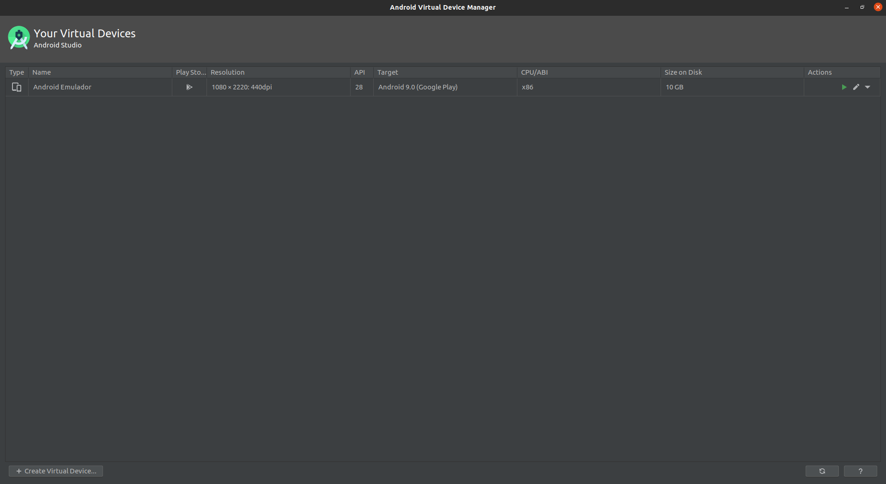

### EXECUTANDO PROJETO LOCALMENTE

##### Backend (API)

Dentro do projeto, já existe um arquivo _docker-compose.yml_ que possui tudo 3 containers **Docker**, um container com o banco de dados **PostgresSQL**, um container com banco de dados **MongoDB** e outro container com o banco de dados para cache **Redis**, basta ter o Docker instalado em sua máquina.

Para iniciar o backend do projeto (API):

```Bash
# Acesse o diretório backend
$ cd backend

# Instale todas as dependencias do projeto
$ yarn

# Crie os containers com PostgresSQL, MongoDB e Redis (necessário ter o docker instalado na máquina)
# O comando abaixo iniciará em background e não irá bloquear o shell
$ sudo docker-compose up -d

# Comando para verificar se os containers estão em execução
$ sudo docker ps -a

# Execute as migrations para o banco de dados
$ yarn typeorm migration:run

# Iniciar backend do goBarber localmente na porta 3333
$ yarn dev:server
```

> **NOTA**: Se os containers não iniciarem ou voce tenha que executar novamente o projeto local, execute os comandos a seguir para inciar os containers, `$ sudo docker start posgtres`, `$ sudo docker start mongodb`, `$ sudo docker start redis`.

##### Frontend (WEB)

Para iniciar o app goBarber na versão frontend (WEB) você preciso primeiro ter iniciado o backend (API) do projeto, certificando que a api esta em pleno funcionamento siga as instruções abaixo:

```Bash
# Acesse o diretório frontend
$ cd frontend

# Instale todas as dependencias do projeto
$ yarn

# Iniciar versão web (frontend) do goBarber localmente na porta 3000
$ yarn start
```

##### Mobile (APP)

Para iniciar o aplicativo do goBarber na versão mobile (APP) também é necessário que o backend (API) do projeto esteja iniciada e em execução, tambem certifique-se de ter um ambiente configurado para executar um emulador de smartphone em seu computador, em minha máquina eu utilizei um emulador android do proprio android estudio, o AVD (Android Virtual Device) utilize uma vm com no minímo android Pie 9 ou mais atualizado, e uma versao tambem com acesso a google play, no meu exemplo eu utilizei uma vm do **_Google Pixel 3a_**

Voce também pode utilizar o Expo, para isso saiba como configurar o expo em seu computador para emular ou até mesmo utilizar seu proprio smartphone.

<div align="center" style="margin-bottom: 20px;">
  
</div>

> **IMPORTANTE**: Caso você utilize o mesmo método que eu para executar a aplicação em um emulador do android studio, logo após iniciar o emulador é importante executar o comando `adb reverse tcp:3333 tcp:3333` no terminal para ter comunicação com o emulador e você conseguir instalar o app do goBarbar.

Para iniciar a versão mobile (APP) do projeto:

```Bash
# Acesse o diretório mobile
$ cd mobile

# Instale todas as dependencias do projeto
$ yarn

# Considerando que seu emulador ja esteja iniciado e que voce ja tenha executado o comando de reverse, instale o aplicativo no emulador.
$ yarn android

# Iniciar app no emulador
$ yarn start
```
