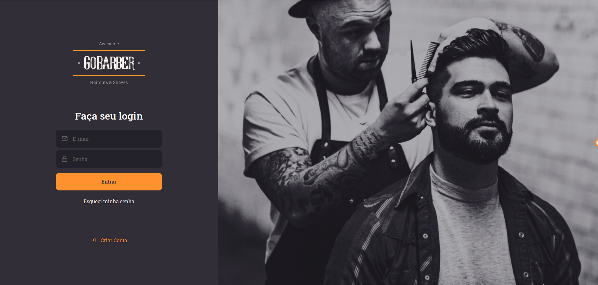
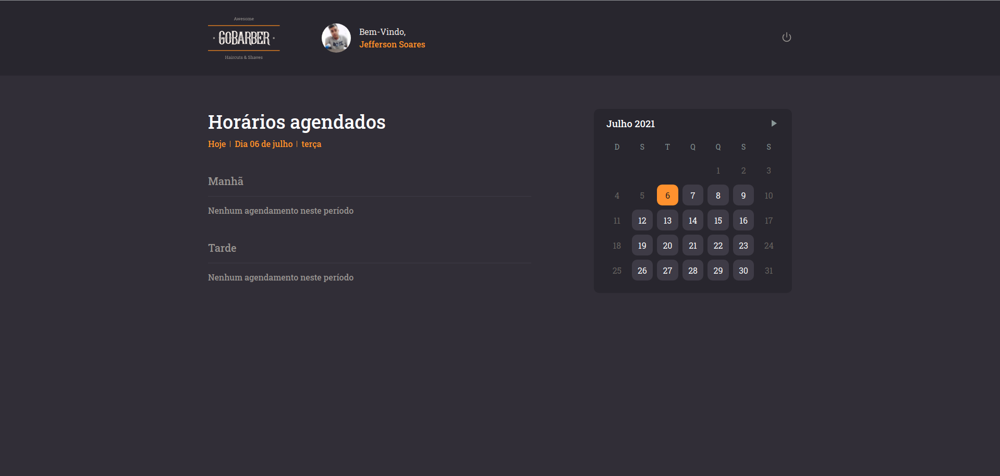
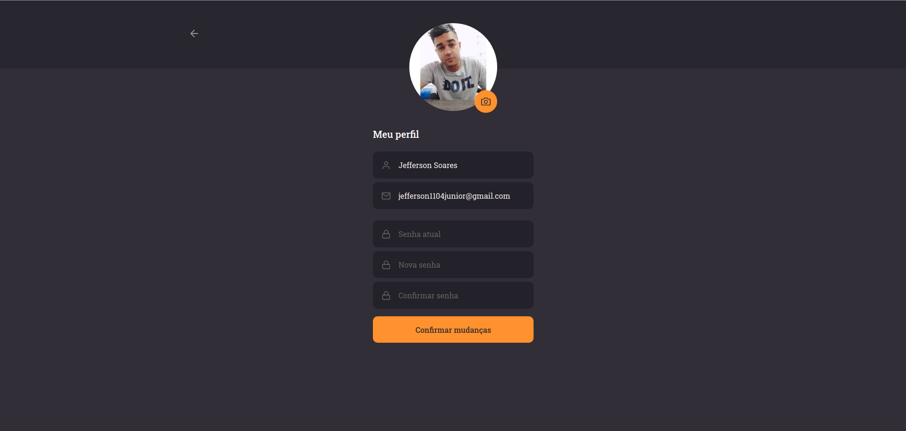
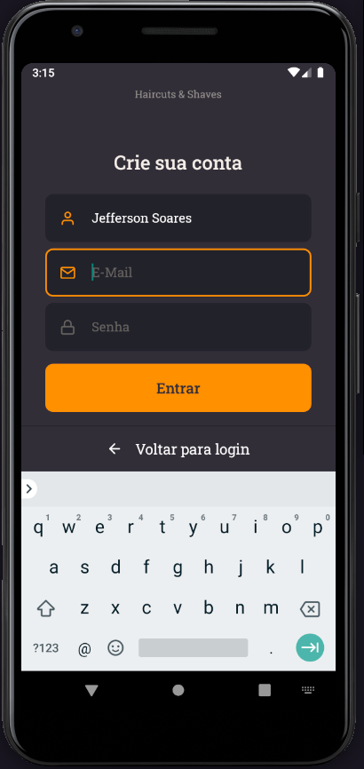
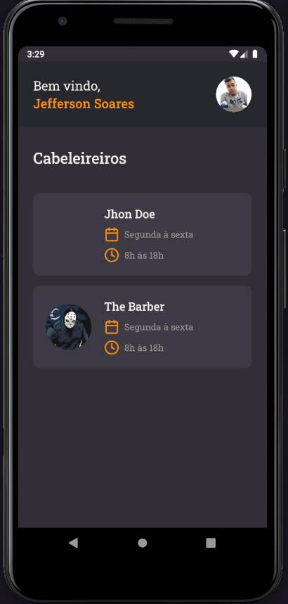
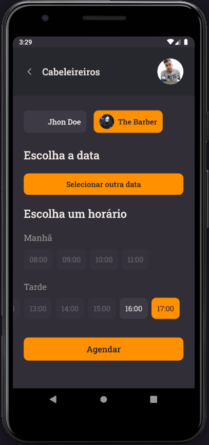

<div align="center" style="margin-bottom: 20px;">
  
</div>

<p align="center">
  

  

  
</p>

#### :barber: O projeto

Aplicativo de agendamento para barbearia, conta com uma api construida com DDD e TDD, uma versão web para consultas e o aplicativo mobile para android/ios.

#### :fire: Prévia da Aplicação

<div align="center"> 
  
</div>

#### :rocket: Principais tecnologias

- [TypeScript](https://www.typescriptlang.org/docs/)
- [NodeJS](https://nodejs.org/en/)
- [ReactJS](https://pt-br.reactjs.org/)
- [React-Native](https://pt-br.reactjs.org/)
- [ExpressJS](https://expressjs.com/pt-br/)
- [Axios](https://github.com/axios/axios)
- [JWT](https://jwt.io/)
- [Styled-Components](https://styled-components.com/)

#### :zap: Como executar este projeto

No arquivo [NOTES](./NOTES.md) contém todas as instruções para você conseguir executar este projeto, nele eu coloquei cada detalhe de como executar a api, criar os bancos de dados em containers, iniciar o frontend e o aplicativo mobile.

#### :thinking: Como Contribuir?

**Faça um fork deste repositório**

```bash
# Clone o seu fork
$ git clone url-do-seu-fork && cd gobarber

# Crie uma branch com sua feature ou correção de bugs
$ git checkout -b minha-branch

# Faça o commit das suas alterações
$ git commit -m 'feature/bugfix: minhas alterações'

# Faça o push para a sua branch
$ git push origin minha-branch
```

Depois que o merge da sua pull request for feito, você pode deletar a sua branch.

#### 🎨 Screenshots

<p align="center">
  
  
  
  
</p>

<p align="center">
  
  
  
  
  
</p>

### :memo: Licença

Este projeto é desenvolvido sob a licença MIT. Veja o arquivo [LICENSE](LICENSE.md) para saber mais detalhes.
